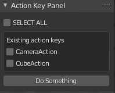

# Actions_toggle
Blender 2.9x example panel to quickly select/de-select actions or individually select actions and perform some operation. Based on https://blenderartists.org/t/how-to-dynamically-generate-boolean-button-panel-list-for-export-functionality/1287897 question.

* `SELECT ALL` Boolean flag part of scene property group on update will cause all other booleans to change to state of `SELECT ALL`.
* Existing action keys area automatically updates to include all action keys in current blend file.
* Individual booleans allow refinement of selection.
* `Do Something` operator prints the names of selected actions.